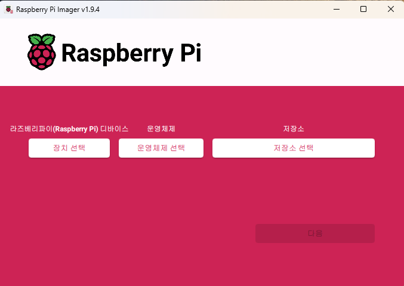
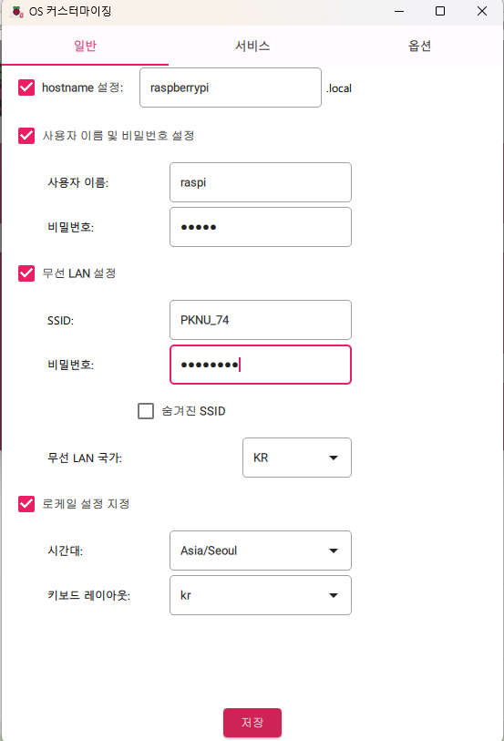
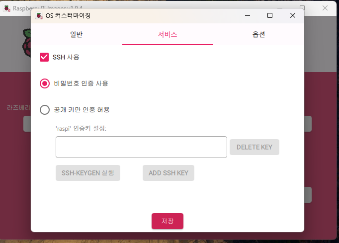
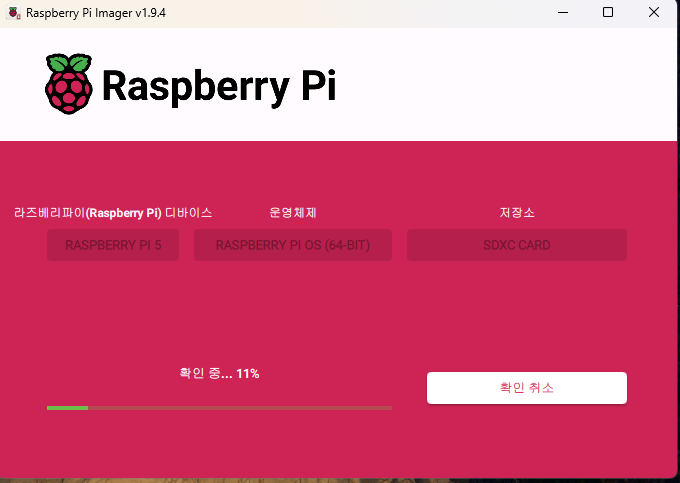
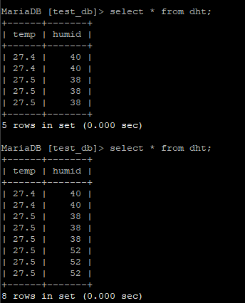

# IoT-raspi-2025
IoT 개발자 라즈베리파이 리포지토리

## 1일차

### 환경설정

#### 공유기 설정
1. 제어판 -> 네트워크 및 공유 센터  -> 연결 : 이더넷3 -> 속성 -> 인터넷 프로토콜 버전 4(TCP/IPv4)
2. 다음 ip주소사용 -> IP주소, 서브넷마스크, 기본게이트웨이 / 다음 DNS 서버주소 사용 -> 기본설정 DNS 서버, 보조 DNS 서버 값 저장
3. 자동으로 IP주소 받기, 자동으로 DNS서버 주소받기로 변경
4. 본체 연결되어있던 렌선을 iptime 공유기에 꼽기
5. 여분의 렌선을 사용하여 iptime의 노란포트에 꼽고, 본체 인터넷 선에 꼽기
6. 192.168.0.1 ipTime 페이지 접속
7. ID : admin, PW : admin으로 로그인
8. 설정마법사 -> 고정 IP방식 사용 -> 2번에서 저장해둔 값 입력 -> 와이파이 ID, PW 입력 -> .. 개인 값 입력 .. > 

#### 라즈베리파이 설정
1. 라즈베리파이 imager
    1. https://www.raspberrypi.com/software/ raspberrypi imager 설치
    2. 본인에게 맞는 값 선택
         
    3. 커스터마이징
        - 일반
            - 사용자 이름 및 비밀번호 설정 체크 후 개인에 맞게 작성
            - 무선 LAN 설정 : 공유기 설정했던 와이파이 ID, PW 입력
            - 로케일 설정 
        
        - 서비스
            - SSH 사용 체크
        
    4. 이미지 굽기
        

2. SD 카드 라즈베리파이에 삽입 후 어댑터 연결
3. 192.168.0.1 페이지 접속 후 admin으로 로그인
4. 관리도구 -> 네트워크 관리 -> 내부 네트워크 설정 에서 라즈베리파이 연결 확인

#### VNC Viewer
1. https://www.realvnc.com/en/connect/download/viewer/ 설치
2. 라즈베리파이 IP주소 또는 hostname 입력 후 연결

## 2일차

### 이론

-  전기 회로 기초
    - 직렬 회로 : 전류 동일, 전압 증가
    - 병렬 회로 : 전류 증가, 전압 동일

    - 전류 방향
        - 실제 전류는 (-) → (+) 방향으로 흐름


- 디지털 vs 아날로그
    - 디지털
        - 0 또는 1로 구성된 신호 (단일값)
        - 정보 변환이 용이하여 많이 사용됨
    - 아날로그
        - 자연 신호에 가깝지만 변환 어려움

- 전압 기준
  - 5V : 1 (HIGH)
  - GND : 0 (LOW)

- **기본 명령어**
    ```python
        import RPi.GPIO as GPIO

        GPIO.setmode(GPIO.BOARD)  # 물리적인 핀 번호 기준
        # 또는
        GPIO.setmode(GPIO.BCM)    # BCM 핀 번호 기준

        GPIO.setup(channel, GPIO.IN or GPIO.OUT)  # 핀 모드 설정
        GPIO.output(channel, GPIO.HIGH or GPIO.LOW)  # 출력 설정
        GPIO.input(channel)  # 입력 읽기

        GPIO.cleanup()  # 핀 초기화
    ```

- 풀다운 저항
    - 저항이 아래(GND)에 연결되어있음
    - 5V 전압이 바로 GND로 흐르지않고 입력 핀으로 흐르게 도와줌
    - 스위치를 안눌렀을 때 기본적으로 0으로 유지

- 풀업 저항
    - 저항이 위(VCC)에 연결되어있음
    - 스위치를 안눌었을 때 : 1 유지
    - 스위치를 눌렀을 때 GND로 연결 : 0 읽음
        - 0은 무조건 OFF가 아님. 

### 라즈베리파이 실습

#### LED, 핀버튼
- 3색 LED
    - RGBG : red, green, blue, GND
        - GND 연결하기때문에 VCC 필요함
        ```python
            # RED 출력
            GPIO.output(RED, GPIO.HIGH)
            GPIO.output(GREEN, GPIO.LOW)
            GPIO.output(BLUE, GPIO.LOW)
        ```
    - RGBV : red, green, blue, VCC
        - VCC 연결하기때문에 GND가 필요함
        ```python
            # RED 출력
            GPIO.output(RED, GPIO.LOW)
            GPIO.output(GREEN, GPIO.HIGH)
            GPIO.output(BLUE, GPIO.HIGH)
        ```

- 핀버튼 
    - S : 핀번호
    - \- : GND
    - 중간핀 : VCC 연결

- [실습](./button_led.py) : 핀버튼을 1번 눌렀을 때 led off, 2번 : red, 3번 : green, 4번 : blue가 되도록

## 3일차

### 라즈베리파이 실습
#### 온습도 센서

- 설치
    ```python
    pip install adafruit-circuitpython-dht
    sudo api install libgpiod2
    ``` 

- [실습1](./dht11.py) : 온습도 센서로 받아온 값 출력
- [실습2](./dth11_db.py) : 온습도 센서로 받아온 값 db에 저장
    

## 4일차 
### PyQt
- 설치
    ```python
    sudo api install python3-pyqt5
    sudo apt install qttools5-dev-tools
    ```

- Putty에서는 실행 불가, VNC viewer에서 실행해야함

